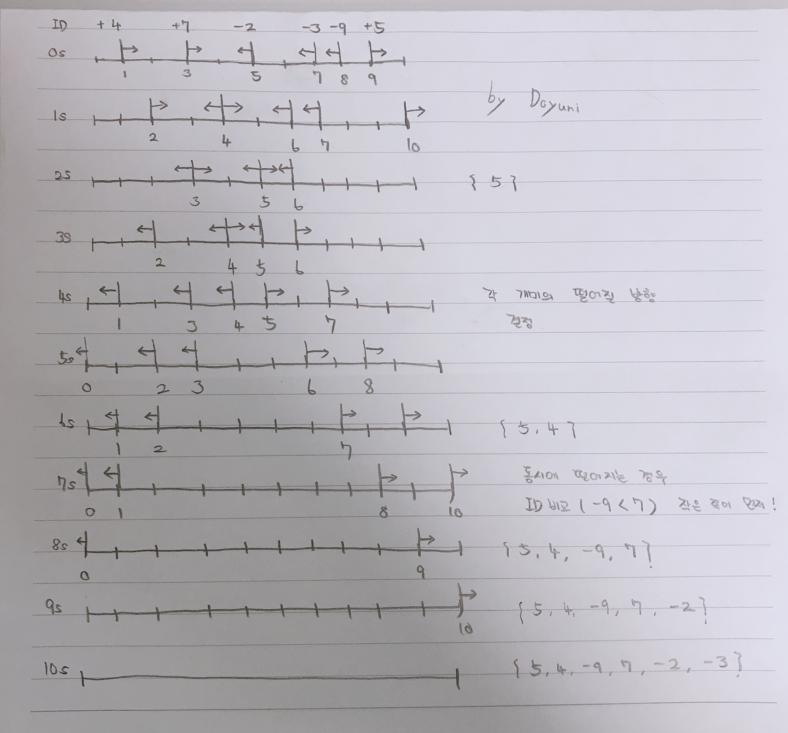

# 떨어지는 개미
* 필요한 data  
  + 개미의 ID ( 방향에 따라 data를 추출해야 하기에 deque을 쓴다. )
  + 개미가 떨어지는 방향 
  + 개미가 떨어지는 시간  
  ( 방향과 시간을 한 쌍으로 담아야 언제 어느 방향으로 떨어지는지 확인이 가능하다. )  
  -> vector 사용, pair data type
* 풀이(접근법)  
  + 개미의 ID의 순서는 변경되지 않는다.
  + 충돌을 신경쓰지 말고 그냥 행진한다.
    * 각각 다 행진시키면서 떨어지는 순서와 방향에 맞게 개미의 ID를 대응하는 방식이다.
  + 다음은 시간 변화에 따른 개미의 이동 과정이다.  


| 위치 | 목적지 |총 이동거리|
|-----|-------|----------|
|  1  |   10  |    9     |
|  3  |   10  |    7     |
|  5  |    0  |    5     |
|  7  |    0  |    7     |
|  8  |    0  |    8     |
|  9  |   10  |    1     |  

* 방향에 따라 이동거리 계산이 다르다.
  * ID > 0 : 총 막대길이 - 위치  
  * ID < 0 : 위치
```
ID       4  7 -2 -3 -9  5
이동거리  5  7  9  8  7  1
```
* ID가 음수면 왼쪽 방향으로 ID가 양수면 오른쪽 방향으로 떨어진다.  
* 이를 이동거리 순으로 정렬한다.  
```
ID       5 -2 -3  7 -9  4
이동거리  1  5  7  7  8  9
```
1. 처음부터 탐색을 시작하여 다음 탐색할 부분과 이동거리가 같은지 확인한다.  
이동 거리가 같은 값은 오직 한 쌍이다. (왼쪽=오른쪽)  
  * 이동거리가 같다면 덱에 있는 ID의 왼쪽과 오른쪽 값을 비교한다.
    * 왼쪽이 더 작다면 현재 벡터 요소의 방향을 확인한다.  
   현재 방향이 오른쪽이라면 왼쪽이 먼저 떨어져야 하기에 swap을 한다. 
     * 오른쪽이 더 크다면 위와 반대로 처리한다.
2. 방향에 따라 덱에서 요소를 빼낸다.
3. 초기화 ( 테스트 케이스가 2개 이상 주어질 수 있기 때문에 )

```c++
#include <iostream>
#include <algorithm>
#include <deque>
#include <vector>
using namespace std;
deque<int> ant_id; // 개미의 ID를 저장할 덱
typedef pair<int, int> vp;
vector<vp> dist; // 방향과 걸린 시간 저장
int main()
{
    int T, total, len, goal;
    cin >> T;
    while (T--)
    {
        cin >> total >> len >> goal;
        int location, id;
        for (int i = 0; i < total; ++i)
        {
            cin >> location >> id;
            ant_id.push_back(id);
            id > 0 ? dist.push_back(vp(len-location,id)) : dist.push_back(vp(location, id));            
        }
        sort(dist.begin(), dist.end());
        int cnt = 1;
        for(auto iter = dist.begin(); iter != dist.end(); ++iter, ++cnt) {
          int ant_time = (*iter).first;
          int next_time = (*(iter+1)).first;
          int direction = (*iter).second;
          if(ant_time == next_time) { // 이동거리가 같을 때
            if(ant_id.back() > ant_id.front()) { // 왼쪽이 좀 더 빨리 떨어지는 경우
                if(direction > 0) { 
                    swap(*iter, *(iter+1));
                    direction = (*iter).second;
                }
            } else { // 오른쪽이 좀 더 빨리 떨어지는 경우
                if(direction < 0) { 
                    swap(*iter, *(iter+1));
                    direction = (*iter).second;
                }
            }
          }
          int result = (direction > 0 ? ant_id.back() : ant_id.front());
          if(cnt == goal) {
              cout << result << endl;
              break;
          }
          direction > 0 ? ant_id.pop_back() : ant_id.pop_front();
        } // 초기화
        ant_id.clear(); 
        dist.clear();
    }
    return 0;
}
```
